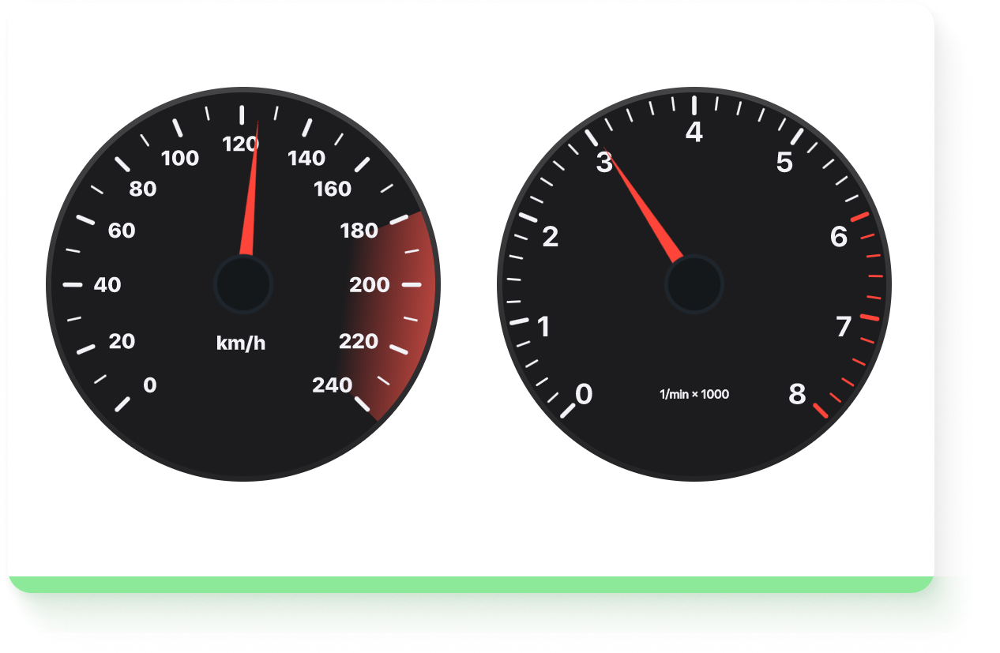

# Vue Speed Measurements

> Vue App wich displays a Speedometer and a RP'm meter.



## Built with

- Vue Cli
- Webpack
- npm

## Live
### [https://netereal.github.io/Vehicle-Speed-Measurement/](https://netereal.github.io/Vehicle-Speed-Measurement/)

## Build Setup

``` bash
# clone the project
$ git clone git@github.com:netereal/Vehicle-Speed-Measurement.git

# install dependencies
npm install

# serve with hot reload at localhost:8080
npm run dev

# build for production with minification
npm run build
```

## Contributor
Maria Novik @netereal
